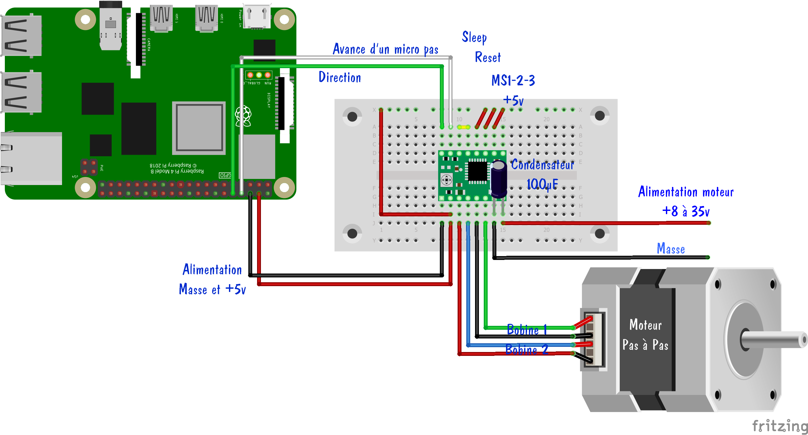

# Introduction

# Design 3D
Le design des pièces est disponible ici :  [Design](/design-3d) 

# Electronique / Câblage
Le projet s'appuie sur un Rapsberry PI 4.

Nous utilisons également des cartes d'extensions pour moteur pas à pas GPIO 40 broches. Les drivers sont de type : DRV8825

La carte driver n°1 est branchée directement sur le Raspberry PI.
La carte driver n°2 est déportée afin de pouvoir adapter les branchements pour permettre le pilotage des 2 cartes par le Raspberry PI.

Nous allons utiliser une carte intermédiaire pour rendre les connexions pour efficace et permettre d'empiler les toutes les cartes à l'aide d'entretoise. [Référence ](https://www.dfrobot.com/product-2579.html)

#### Cablage carte n°1

#### Cablage carte n°2

# Programmation

## 01 - Commande moteur
Il s'agit d'un premier test de pilotage de moteur pas à pas. 
* [code source](/src/python/01-commande-moteur) 
* [inspiration](https://www.framboise314.fr/piloter-un-moteur-pas-a-pas-avec-le-raspberry-pi-et-un-driver-a4988/#Programmes_sur_Github)
* Utilisation de RPi.GPIO

## 02 - Commande de 2 moteurs
Il s'agit d'un test de pilotage de 2 moteurs pas à pas. 
* [code source](/src/python/02-commande-2-moteurs) 
* Utilisation de RPi.GPIO

## 03 - Full
Dans ce test, on prend en charge tous les moteurs du bras robotisé.
* [code source](/src/python/full) 
* Utilisation du pilote DRV8825

